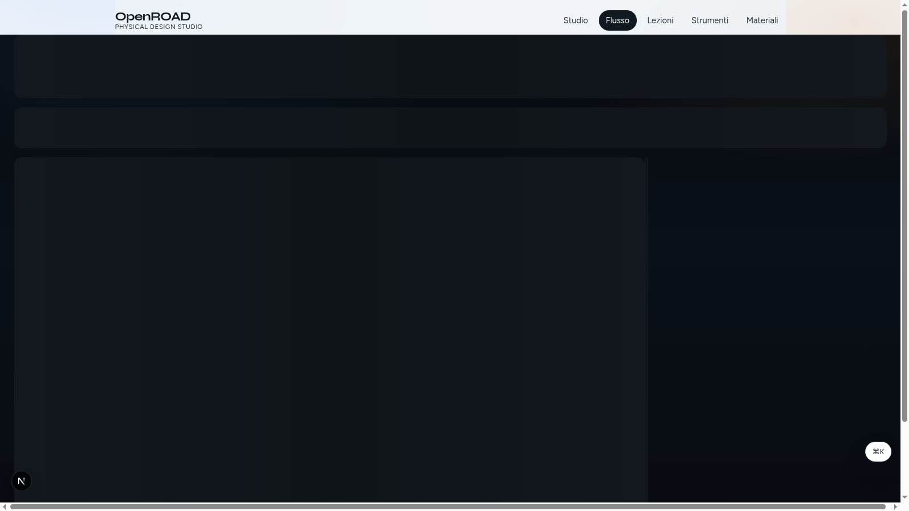
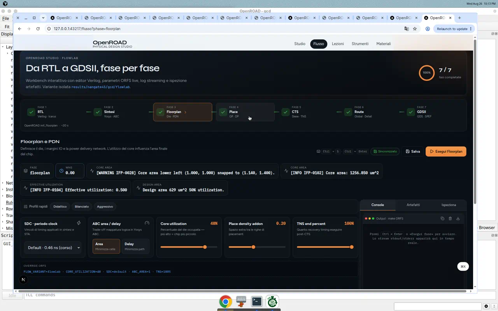
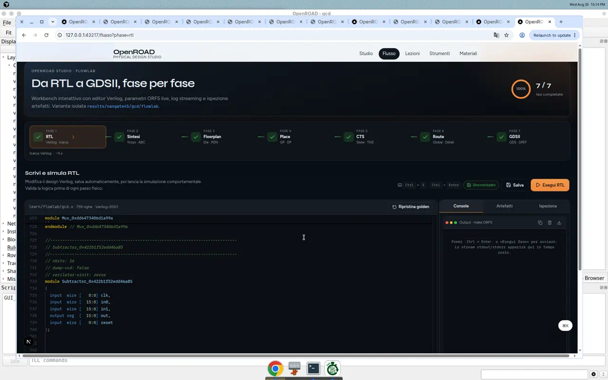
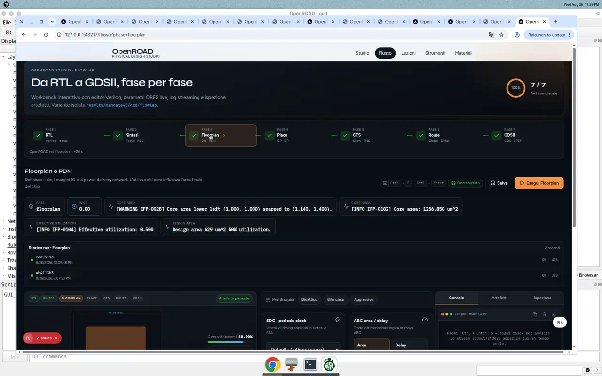
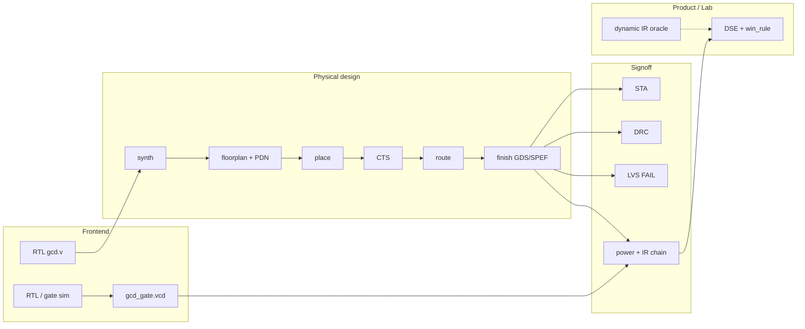

# PDflow

**Open-source RTL → GDS with honest power integrity — not another screenshot of `make finish`.**

[](studio/README.md)

PDflow is a physical-design workspace built on OpenROAD / ORFS: a guided course, a FlowLab workbench, and a product-grade design-space loop underneath. Timing, area, power, leakage, and IR are reported together. Failures stay failures.

> Educational Nangate45 / FreePDK45. Not a foundry sign-off deck. No fake `.lvs.ok`.

---

## About

I'm **Alessandro Angora** — physical design engineer focused on **implementation + power integrity** on open tools, not slide-deck sign-off.

This repository is my public lab: a full **RTL → GDS** path on OpenROAD, a **gate-VCD → chip → package** power chain, explicit **WORKS / FAIL / GAP** labels, and a **product DSE loop** with a written [win rule](learn/dse/win_rule.py). I care about showing what closed, what failed, and what we deliberately do not fake.

Sharing on LinkedIn? Use [docs/social-preview.md](docs/social-preview.md) and upload [`docs/assets/social-preview.png`](docs/assets/social-preview.png) as the GitHub social preview image.

---

## What makes this different

| Typical PD portfolio | This repository |
|---|---|
| One GCD screenshot | **43 / 46** live tool hooks · pipeline **6 / 6** on FlowLab GCD |
| “Ran OpenROAD once” | RTL sim → gate VCD name-join → activity → chip PDN → package PDN → thermal |
| Hidden red X’s | [Suite status](learn/reference/suite-status.md) labels **WORKS / FAIL / GAP** explicitly |
| Tweaked one knob | Written [win rule](learn/dse/win_rule.py) · catalog + TPE · honest [results](docs/results.md) |

Three surfaces live in one tree — **do not mix them**:

| Surface | What it is | Start here |
|---|---|---|
| **Course / Studio** | Lessons, FlowLab GUI, signoff actions | [studio/README.md](studio/README.md) · `./scripts/run_studio.sh` |
| **Lab** | e-graph, IR oracle, multi-fidelity DSE | [learn/dse/README.md](learn/dse/README.md) |
| **Product** | Physical knobs, fixed die, real finish, win/lose | [docs/product.md](docs/product.md) |

---

## Live GCD snapshot (FlowLab · Nangate45)

Numbers from `learn/sim/reports/*_flowlab.json` on a cooked `gcd/flowlab/` tree.

| Pillar | Result | Honest note |
|---|---|---|
| **RTL → GDS** | Synth → finish **WORKS** | `6_final.gds` / `.spef` / `.odb` on disk |
| **STA** | WNS **−0.02 ns** · TNS −0.14 · 3 viol | OpenSTA on Nangate, not PrimeTime |
| **DRC** | **0** route · **0** GDS | KLayout signoff |
| **LVS** | **FAIL** | `Netlists don't match` · no `.lvs.ok` |
| **Power** | Chip IR **3.09 mV** · sys droop **6.27 mV** | Lumped board, not Touchstone |
| **Gate activity** | `GATE_SIM_PASS` · `gcd_gate.vcd` | Functional GLS, not SDF |
| **Dynamic IR** | Gold **45.298 mV** (LOCKED) | Separate from chip PDN **28.3 mV** mesh |
| **Thermal** | HotSpot **70.54 °C** | Architecture compact model |
| **PEX / models** | OpenRCX 657 nets · FasterCap BEM · **19-cell** PTM CCS sidecar | Official liberty stays **NLDM** |

Full matrix: [learn/reference/suite-status.md](learn/reference/suite-status.md).

---

## FlowLab (screenshots)

| Pipeline & signoff | RTL editor (Monaco) | Layout viewport |
|---|---|---|
|  |  |  |

Run locally: `./scripts/run_studio.sh` → [http://127.0.0.1:43217/flow](http://127.0.0.1:43217/flow). More captures: [`studio/docs/images/flowlab/`](studio/docs/images/flowlab/).

**Dynamic IR heatmap** (I(t) per pin; gold mesh **45.298 mV** is separate from chip PDN transient):


---



Power chain detail: [learn/reference/extended-flow.md](learn/reference/extended-flow.md) · [spice-power-chain.md](learn/reference/spice-power-chain.md).

---

## 60-second tour (for recruiters)

1. **Open FlowLab** — `./scripts/run_studio.sh` → [http://127.0.0.1:43217/flow](http://127.0.0.1:43217/flow)  
   Monaco RTL editor, seven-phase pipeline, layout viewport, signoff console.
2. **Read the honest map** — [suite-status.md](learn/reference/suite-status.md) (what works, what fails, what is intentionally missing).
3. **See the product discipline** — [win_rule.py](learn/dse/win_rule.py) + [results.md](docs/results.md) (wins and losses on real cooks, not vibes).
4. **Skim a power artifact** — `learn/sim/reports/dynamic_ir_flowlab.svg` (I(t) heatmap; gold mesh separate from chip PDN).

---

## Quick start

```bash
# 1) Environment (Cloud Agent or local — see docs/install.md)
PD_FLOW_PROFILE=core EDA_JOBS=2 bash scripts/cloud_agent_install.sh

# 2) Studio + FlowLab
./scripts/run_studio.sh
# → http://127.0.0.1:43217

# 3) Honesty gates (fast)
PYTHONPATH=learn:learn/scripts python3 learn/scripts/test_signoff_honesty.py
PYTHONPATH=learn:learn/scripts python3 learn/scripts/test_lab_physics.py
```

Headless ORFS only:

```bash
./scripts/run_gcd_flow.sh
```

Full install, versions, and troubleshooting: [docs/install.md](docs/install.md).

---

## Highlights worth opening

| Topic | Where |
|---|---|
| FlowLab UI & APIs | [studio/README.md](studio/README.md) |
| 8-lesson course | [learn/README.md](learn/README.md) · [CURRICULUM.md](learn/CURRICULUM.md) |
| Extended signoff (gate sim, RDL, HotSpot, Xyce, FasterCap, CCS) | [extended-flow.md](learn/reference/extended-flow.md) |
| OSS tool matrix | [oss-integrations.md](learn/reference/oss-integrations.md) |
| Physically-aware DSE stack | [dse.md](learn/reference/dse.md) |
| Native IR solvers (`libdpn`) | [engine/README.md](engine/README.md) |
| Product operations & tests | [docs/operations.md](docs/operations.md) |
| Architecture & ownership | [docs/architecture.md](docs/architecture.md) |

---

## Toolchain

OpenROAD **26Q2** · Yosys **0.63** · OpenSTA **3.1.0** · KLayout **0.30.11** · ngspice · vyges-em-ir · optional HotSpot / Xyce / FasterCap.

Tested on **Ubuntu 24.04** (22.04 supported).

---

## Contributing & agents

- [CONTRIBUTING.md](CONTRIBUTING.md)
- [AGENTS.md](AGENTS.md) — operational rules (three surfaces, honest signoff, no gold IR restamp)

Documentation index: [docs/README.md](docs/README.md).
