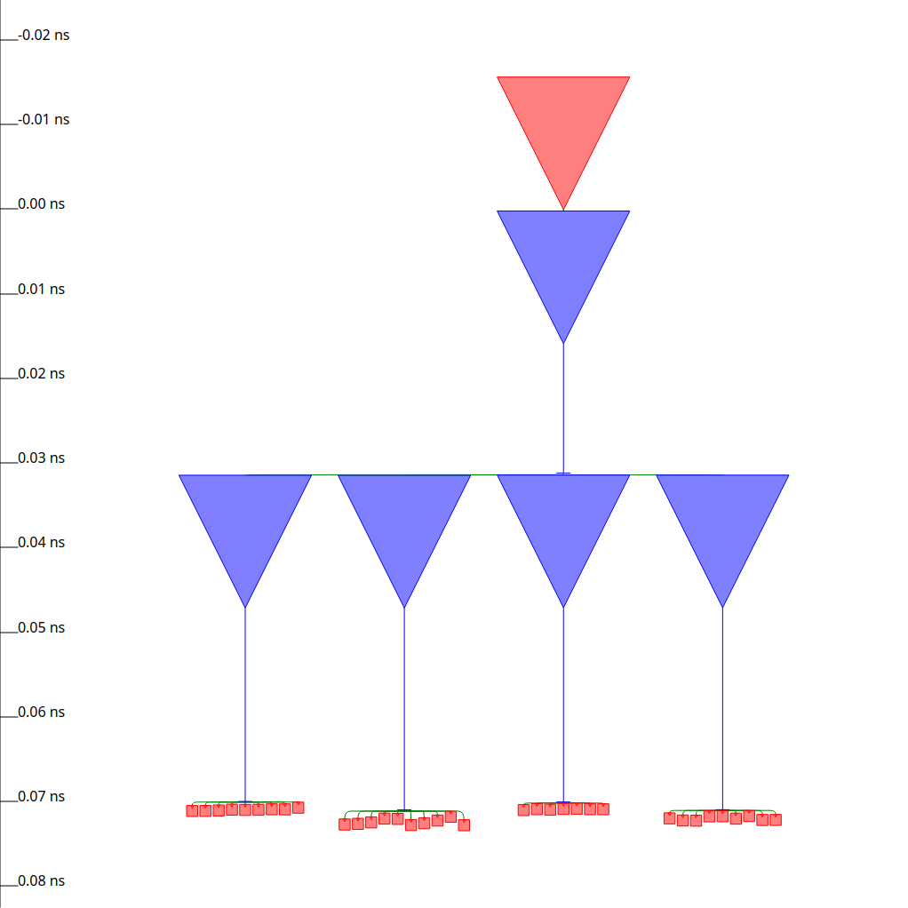
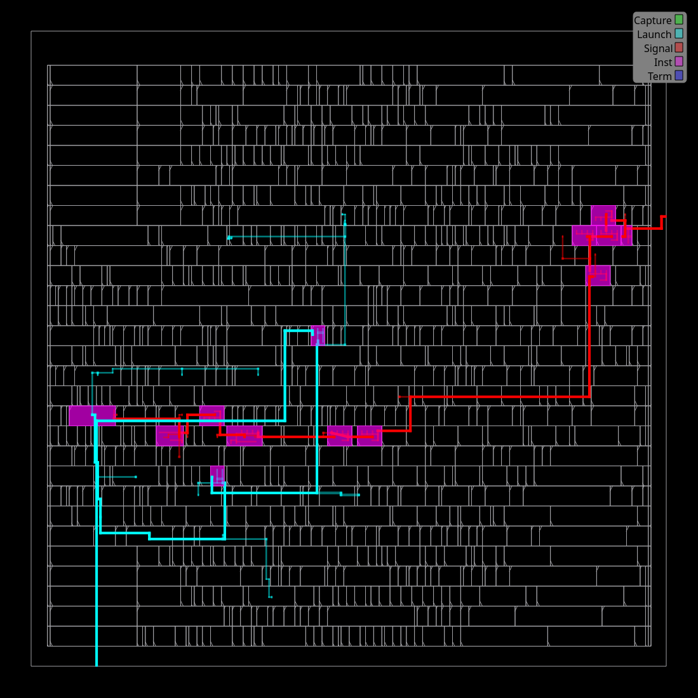
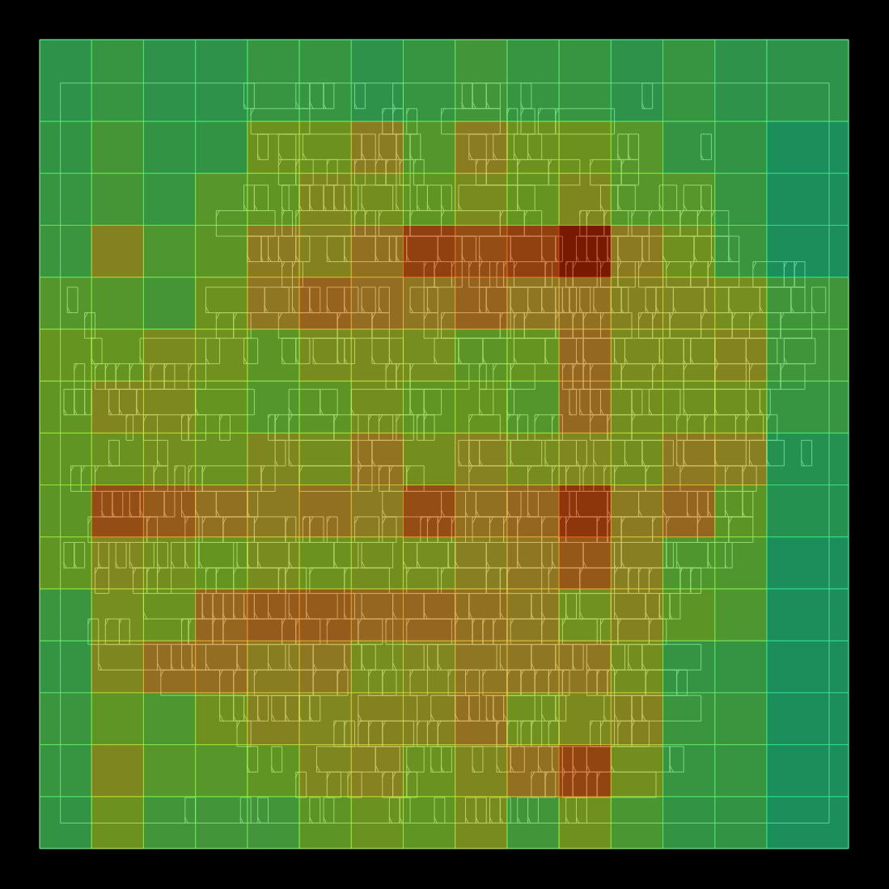
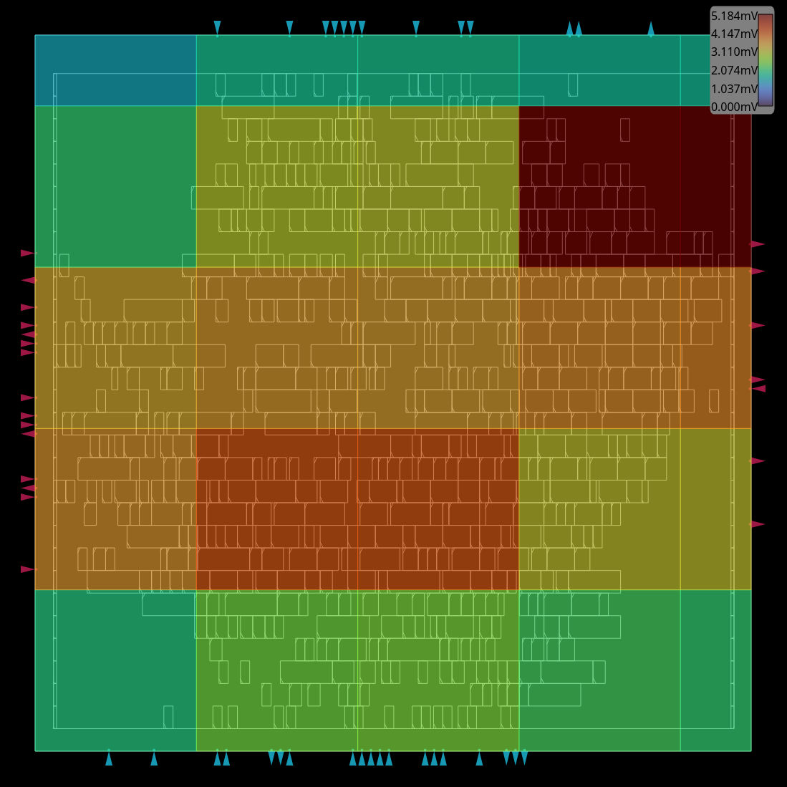

# OpenROAD GUI atlas

This atlas is a visual map for inspecting the current artifacts. It is not a
metric catalogue. Use the GUI target for the same `FLOW_VARIANT` and report
the file that was opened.

## Window anatomy

1. menu and toolbar;
2. object browser;
3. display controls;
4. central layout canvas;
5. status bar;
6. Tcl console;
7. inspector/details panel.

The browser selects objects. Display controls toggle layers, instances, nets,
pins, rows, routing, and power shapes. The canvas is a view of the loaded ODB,
not a second source of truth.

## Stage gallery

Open these in order after the corresponding stage has completed:

For each image, identify the input path, the visible layer/object state, and
one observation from the current log. Do not infer a numeric result from the
image.

## Useful views

Toggle M2/M3 together to inspect routing continuity. Toggle clock nets to
inspect CTS. Use the selection inspector for a cell, net, ITerm, or power pin.
The console is useful for `report_checks`, `report_clock_skew`, and object
queries. Save an image only after noting which ODB is loaded.

## Power views

The ORFS PDNSim view, Dynamic IR heatmap, chip mesh, and package mesh are
different panels. The Studio UI should show their report ids and fingerprints
before allowing a comparison. A missing or incompatible mesh must stay
visible as `GAP`.

## GUI checklist

1. Confirm the process finished successfully.
2. Confirm the ODB path belongs to the current invocation.
3. Confirm the selected layer and object filters.
4. Capture the view or use the inspector.
5. Cross-check the observation in the current JSON/log.
6. Record missing tools and paths as gaps.

The web preview cannot display a native Qt window. Use the local desktop or
the Studio layout viewer for browser-safe inspection.

## Studio app workflow

The app is the control surface for the flow; the native tool remains the
authoritative editor for its database. A phase panel exposes the action,
input, output, and current status in one place. Its controls follow this
sequence:

1. select the phase and variant;
2. open the native tool or browser-safe viewer;
3. make the edit in the tool;
4. save the ODB/DEF from that tool;
5. press Refresh in Studio and inspect the new fingerprint.

The refresh step is deliberate. It reads the artifact's metadata and report
again, so the app cannot display a stale geometry as if it were the saved
database. If the tool writes a sidecar, the panel names that sidecar and
keeps the protected finish artifact separate.

## Floorplan hand-off

Floorplan is a live tool target, not a static HTML illustration. Open it from
the Floorplan phase to launch OpenROAD with the current floorplan ODB, or use
the browser viewer when a desktop window is unavailable. The app shows the
die box, core box, row count, utilization, and artifact fingerprint returned
by the current database.

After changing the die, margins, rows, or PDN in OpenROAD, save the database
and refresh the phase. The geometry card updates from the saved DEF/ODB and
the next runnable actions are recalculated. A change that invalidates a
downstream artifact is shown as blocked until the dependent phase is run
again; no old timing or IR value is carried forward.

## Browser-safe inspection

The layout viewer is useful for review and screenshots. It is not a second
layout editor: edits must be made in the native tool or by a named Studio
action. The viewer response includes the served artifact path and a fresh
tokenized image URL. If the artifact is absent, the UI shows the missing path
and the command needed to produce it.

For a reproducible observation, record:

- the phase and `FLOW_VARIANT`;
- the exact ODB or DEF path;
- the artifact fingerprint and modification time;
- the visible layers and selected object;
- the report or log that supports the observation.

This makes a GUI observation auditable without turning the screenshot into a
metric source.

## Native-tool controls

OpenROAD controls are grouped by purpose: database load/save, display
visibility, selection, Tcl commands, and viewport navigation. Use the app
bridge for launch and artifact refresh, then use the native controls for the
edit itself. The bridge never guesses that a click changed geometry.

For floorplan work, inspect die and core rectangles, row orientation, IO
placement, tap/endcap cells, and special power wires. For PDN work, inspect
the VDD and VSS nets independently. For placement and route work, select a
cell or net and verify its layer and coordinates in the inspector.

## Troubleshooting the bridge

If OpenROAD does not start, check the Desktop display and copy the command
shown by Studio. If it starts but the app stays at `Waiting for ODB`, confirm
that the native session saved the exact path shown in the bridge. If the
preview is blank, use `PNG from ODB` and inspect the live log. A missing image
does not change the artifact status.

The same procedure applies to KLayout: open the current GDS, save nothing to
the core ODB, and return to Studio for a fresh artifact check. Keep DRC/LVS
observations attached to their report paths.
